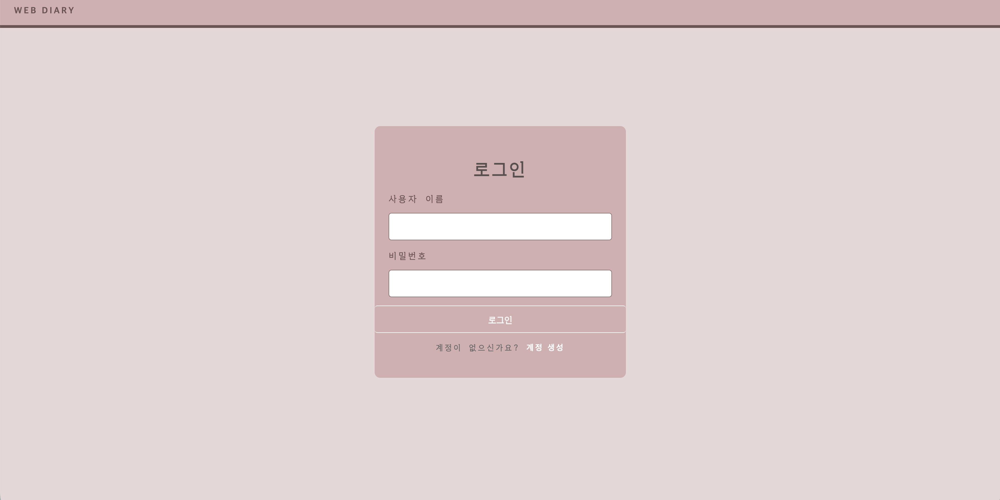
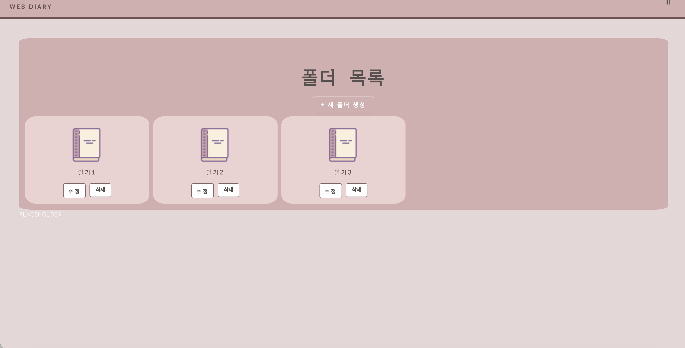
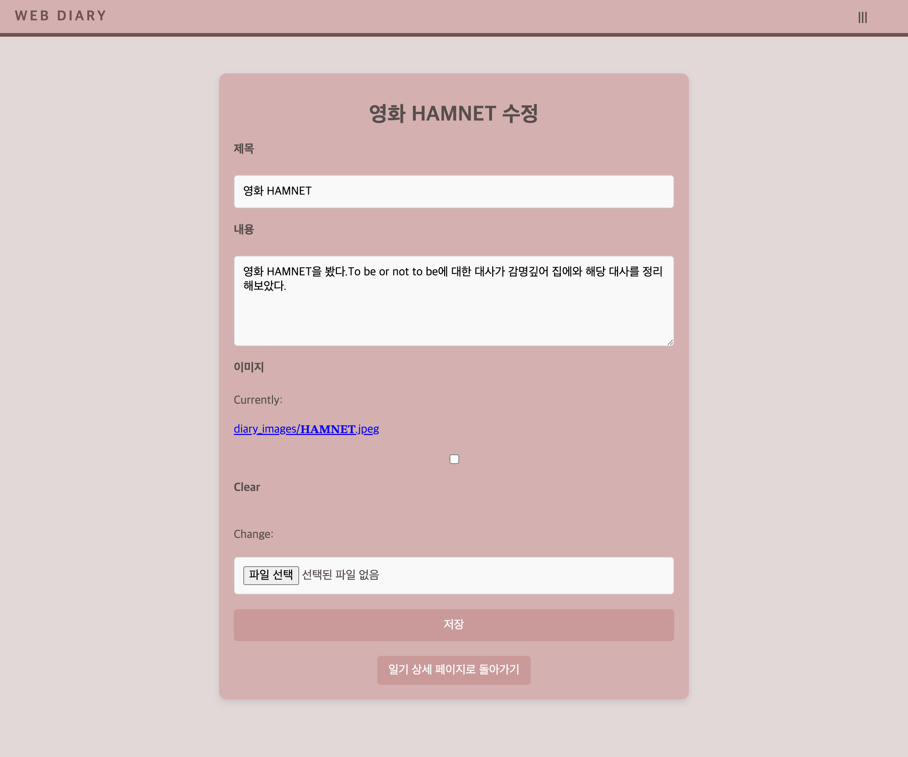

# Web Diary (Django)

A Django-based web diary app with authentication, diary CRUD, and folder organization.

## Features
- Sign up / Log in / Log out
- Create, view, edit diary entries
- Organize entries with folders (create / list / detail / edit)
- Static assets (images, styling)

## Tech Stack
- Python, Django
- HTML/CSS (Django templates)
- SQLite (local)

## Project Structure
- `config/` : Django project settings, urls
- `webDiary/` : Main app (models, views, forms, urls)
- `static/` : Static files (images/css)
- `manage.py` : Django entry point

## How to Run (Local)
```bash
pytho3 -m venv venv
source venv/bin/activate  # macOS
pip install -r requirements.txt
python3 manage.py migrate
python3 manage.py runserver
```

Open: http://127.0.0.1:8000/

## Screenshots





## What I learned 

- Contributed to the UI/UX design of a web diary app (layout, color palette, typography, spacing).

- Implemented template-based page UIs in Django, following shared styling conventions across the team.

- Helped refine user flow and information hierarchy to improve usability.