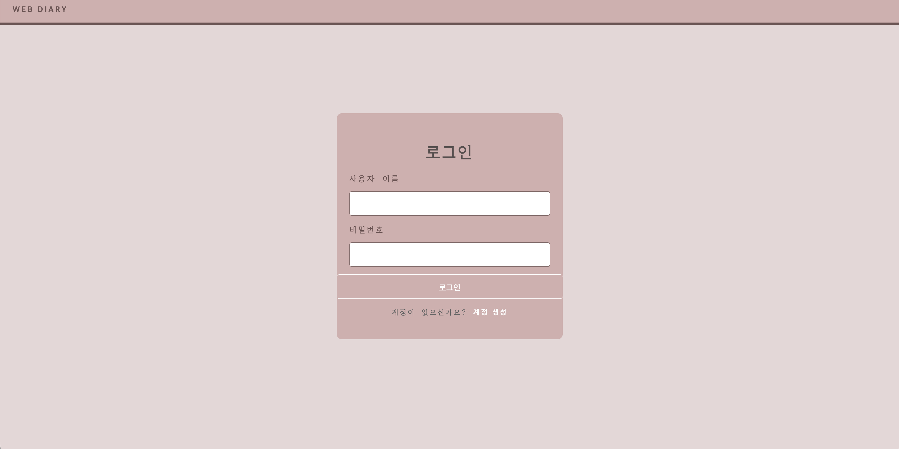
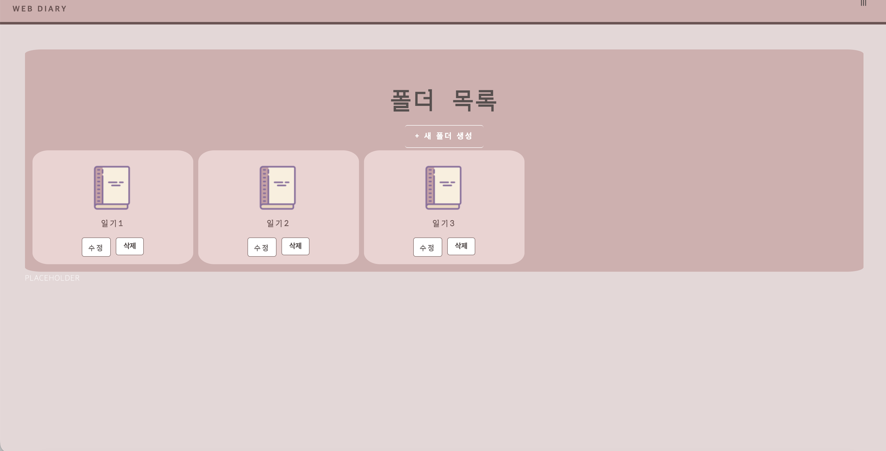
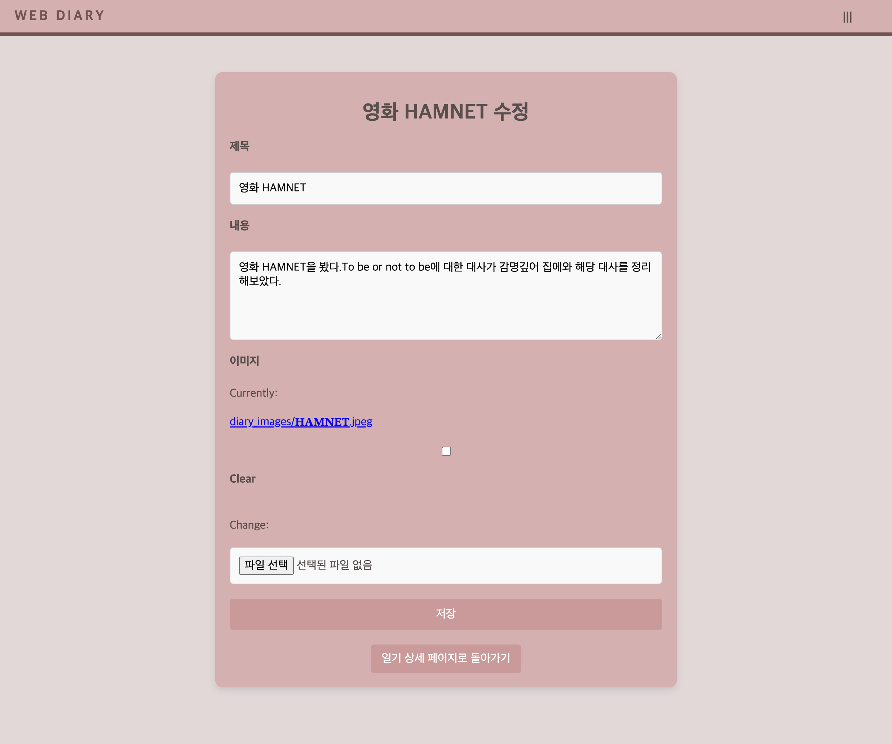

# Web Diary (Django)

A Django-based web diary app developed as a team project, featuring authentication, diary CRUD, and folder organization.

## Features
- User authentication (sign up, log in, log out)
- Create, view, edit, and delete diary entries
- Organize diary entries with folders
- Static files management for images and styling

## Tech Stack
- Python
- Django
- HTML
- CSS
- SQLite

## Project Structure
- `config/` : Django project settings and URLs
- `webDiary/` : Main app (models, views, forms, URLs)
- `static/` : - Static file handling for styling and assets
- `images/` : Screenshots used in the README
- `manage.py` : Django project entry point

## How to Run (Local)
```bash
python3 -m venv venv
source venv/bin/activate  # macOS
pip install -r requirements.txt
python3 manage.py migrate
python3 manage.py runserver
```

Open: http://127.0.0.1:8000/

## Screenshots





## My Contribution

- Contributed to the UI/UX design direction in a team project
- Implemented page layouts and styling using HTML, CSS, and Django templates
- Improved visual hierarchy and overall usability of the diary pages

## What I Learned

- How to translate a selected design direction into actual page layouts and styling
- How to build and style pages using HTML, CSS, and Django templates
- How to improve usability through clearer visual hierarchy and content structure
- How to collaborate on a team project and contribute to frontend implementation

## Future Improvements

- Improve the overall UI design and responsiveness
- Add search and filtering features for diary entries
- Add image upload and media management improvements
- Deploy the project online